# Database Schema and Data Models Documentation

## Overview

This document provides a comprehensive overview of the database schema and Eloquent models for the task management application. The application uses **SQLite** as the database engine and follows Laravel conventions for model relationships and database structure.

## Entity Relationship Diagram

```mermaid
erDiagram
    %% Core Models
    User ||--o{ Task : "has many"
    User ||--o{ Event : "has many"
    User ||--o{ Project : "has many"
    User ||--o| PomodoroSettings : "has one"
    User ||--o| NotificationPreference : "has one"
    User ||--o{ PomodoroSession : "has many"
    User ||--o{ Reminder : "has many"
    User ||--o{ Notification : "has many"

    %% Task Relationships
    Task }o--|| User : "belongs to"
    Task }o--o| Project : "belongs to"
    Task }o--o| Event : "belongs to"
    Task ||--o| RecurringTask : "has one"
    Task ||--o{ PomodoroSession : "has many"
    Task }o--o{ Tag : "morphToMany"
    Task }o--o{ Reminder : "morphMany"
    Task }o--o{ Notification : "morphMany"

    %% Event Relationships
    Event }o--|| User : "belongs to"
    Event ||--o| RecurringEvent : "has one"
    Event }o--o{ Tag : "morphToMany"
    Event }o--o{ Reminder : "morphMany"
    Event }o--o{ Notification : "morphMany"

    %% Project Relationships
    Project }o--|| User : "belongs to"
    Project ||--o{ Task : "has many"
    Project }o--o{ Tag : "morphToMany"
    Project }o--o{ Reminder : "morphMany"
    Project }o--o{ Notification : "morphMany"

    %% Recurring Task Relationships
    RecurringTask }o--|| Task : "belongs to"
    RecurringTask ||--o{ TaskInstance : "has many"
    RecurringTask ||--o{ TaskException : "has many"

    %% Recurring Event Relationships
    RecurringEvent }o--|| Event : "belongs to"
    RecurringEvent ||--o{ EventInstance : "has many"
    RecurringEvent ||--o{ EventException : "has many"

    %% Instance Relationships
    TaskInstance }o--|| RecurringTask : "belongs to"
    TaskInstance }o--o| Task : "belongs to"
    EventInstance }o--|| RecurringEvent : "belongs to"
    EventInstance }o--o| Event : "belongs to"

    %% Exception Relationships
    TaskException }o--|| RecurringTask : "belongs to"
    TaskException }o--o| TaskInstance : "replacement"
    TaskException }o--o| User : "created by"
    EventException }o--|| RecurringEvent : "belongs to"
    EventException }o--o| EventInstance : "replacement"
    EventException }o--o| User : "created by"

    %% Tag Polymorphic
    Tag ||--o{ Taggable : "morphToMany"
    Taggable }o--|| Task : "taggable"
    Taggable }o--|| Event : "taggable"
    Taggable }o--|| Project : "taggable"

    %% Reminder Polymorphic
    Reminder }o--|| User : "belongs to"
    Reminder }o--o| Task : "remindable"
    Reminder }o--o| Event : "remindable"
    Reminder }o--o| Project : "remindable"

    %% Notification Polymorphic
    Notification }o--|| User : "belongs to"
    Notification }o--o| Task : "notifiable"
    Notification }o--o| Event : "notifiable"
    Notification }o--o| Project : "notifiable"

    %% User Model
    User {
        integer id PK
        varchar name
        varchar email UK
        datetime email_verified_at
        varchar workos_id UK
        varchar remember_token
        text avatar
        datetime created_at
        datetime updated_at
    }

    %% Task Model
    Task {
        integer id PK
        integer user_id FK
        varchar title
        text description
        varchar status
        varchar priority
        varchar complexity
        integer duration
        date start_date
        date end_date
        integer project_id FK
        integer event_id FK
        datetime completed_at
        datetime created_at
        datetime updated_at
        datetime deleted_at
    }

    %% Event Model
    Event {
        integer id PK
        integer user_id FK
        varchar title
        text description
        datetime start_datetime
        datetime end_datetime
        tinyint all_day
        varchar timezone
        varchar location
        varchar color
        varchar status
        integer recurring_event_id FK
        datetime created_at
        datetime updated_at
        datetime deleted_at
    }

    %% Project Model
    Project {
        integer id PK
        integer user_id FK
        varchar name
        text description
        date start_date
        date end_date
        datetime created_at
        datetime updated_at
        datetime deleted_at
    }

    %% Tag Model
    Tag {
        integer id PK
        varchar name UK
        datetime created_at
        datetime updated_at
    }

    %% Reminder Model
    Reminder {
        integer id PK
        integer user_id FK
        varchar remindable_type
        integer remindable_id
        varchar reminder_type
        datetime trigger_time
        varchar time_before_unit
        integer time_before_value
        tinyint is_recurring
        tinyint is_sent
        datetime sent_at
        datetime created_at
        datetime updated_at
    }

    %% Notification Model
    Notification {
        integer id PK
        integer user_id FK
        varchar notifiable_type
        integer notifiable_id
        varchar notification_type
        varchar title
        text message
        text data
        tinyint is_read
        datetime read_at
        varchar channel
        tinyint channel_sent
        datetime created_at
        datetime updated_at
    }

    %% NotificationPreference Model
    NotificationPreference {
        integer id PK
        integer user_id UK
        tinyint reminder_notifications_enabled
        tinyint task_due_notifications_enabled
        tinyint event_start_notifications_enabled
        tinyint pomodoro_notifications_enabled
        tinyint achievement_notifications_enabled
        tinyint system_notifications_enabled
        tinyint in_app_enabled
        tinyint email_enabled
        tinyint push_enabled
        tinyint quiet_hours_enabled
        time quiet_hours_start
        time quiet_hours_end
        varchar notification_frequency
        datetime created_at
        datetime updated_at
    }

    %% PomodoroSettings Model
    PomodoroSettings {
        integer id PK
        integer user_id UK
        integer work_duration_minutes
        integer break_duration_minutes
        integer long_break_duration_minutes
        integer cycles_before_long_break
        tinyint sound_enabled
        tinyint notifications_enabled
        tinyint auto_start_next_session
        tinyint auto_start_break
        datetime created_at
        datetime updated_at
    }

    %% PomodoroSession Model
    PomodoroSession {
        integer id PK
        integer user_id FK
        integer task_id FK
        date session_date
        datetime start_time
        datetime end_time
        integer duration_minutes
        integer work_cycles
        integer break_cycles
        tinyint is_completed
        integer interruptions
        text notes
        datetime created_at
        datetime updated_at
    }

    %% RecurringTask Model
    RecurringTask {
        integer id PK
        integer task_id UK
        varchar recurrence_type
        integer interval
        date start_date
        date end_date
        varchar days_of_week
        datetime created_at
        datetime updated_at
    }

    %% RecurringEvent Model
    RecurringEvent {
        integer id PK
        integer event_id UK
        varchar recurrence_type
        integer interval
        varchar days_of_week
        integer day_of_month
        varchar nth_weekday
        text rrule
        date start_date
        date end_date
        integer occurrence_count
        varchar timezone
        datetime created_at
        datetime updated_at
    }

    %% TaskInstance Model
    TaskInstance {
        integer id PK
        integer recurring_task_id FK
        integer task_id FK
        date instance_date
        varchar status
        varchar overridden_title
        text overridden_description
        datetime completed_at
        datetime created_at
        datetime updated_at
    }

    %% EventInstance Model
    EventInstance {
        integer id PK
        integer recurring_event_id FK
        integer event_id FK
        datetime instance_start
        datetime instance_end
        varchar status
        varchar overridden_title
        text overridden_description
        varchar overridden_location
        tinyint all_day
        varchar timezone
        tinyint cancelled
        datetime completed_at
        datetime created_at
        datetime updated_at
    }

    %% TaskException Model
    TaskException {
        integer id PK
        integer recurring_task_id FK
        date exception_date
        tinyint is_deleted
        integer replacement_instance_id FK
        text reason
        integer created_by FK
        datetime created_at
        datetime updated_at
    }

    %% EventException Model
    EventException {
        integer id PK
        integer recurring_event_id FK
        date exception_date
        tinyint is_deleted
        integer replacement_instance_id FK
        text reason
        integer created_by FK
        datetime created_at
        datetime updated_at
    }
```



## Core Models

### User Model

**Table:** `users`
**Model:** `App\Models\User`
**Purpose:** Authentication and user management

#### Schema

| Column | Type | Constraints | Description |
|--------|------|-------------|-------------|
| `id` | integer | Primary Key | Auto-incrementing ID |
| `name` | varchar | | User's full name |
| `email` | varchar | Unique | User's email address |
| `email_verified_at` | datetime | Nullable | Email verification timestamp |
| `workos_id` | varchar | Unique | WorkOS integration ID |
| `remember_token` | varchar | Nullable | Remember me token |
| `avatar` | text | Nullable | Avatar URL/path |
| `created_at` | datetime | | Creation timestamp |
| `updated_at` | datetime | | Last update timestamp |

#### Indexes

- Primary Key: `id`
- Unique: `email` (`users_email_unique`)
- Unique: `workos_id` (`users_workos_id_unique`)

#### Model Relationships

```php
// Has Many
tasks(): HasMany
projects(): HasMany
events(): HasMany
pomodoroSessions(): HasMany
reminders(): HasMany
notifications(): HasMany

// Has One
pomodoroSettings(): HasOne
notificationPreferences(): HasOne
```

#### Fillable Attributes

- `name`
- `email`
- `workos_id`
- `avatar`

#### Casts

- `email_verified_at` → `datetime`
- `password` → `hashed`

#### Special Methods

- `initials(): string` - Returns user's initials from name

---

### Task Model

**Table:** `tasks`
**Model:** `App\Models\Task`
**Purpose:** Task management with status, priority, complexity tracking

#### Schema

| Column | Type | Constraints | Description |
|--------|------|-------------|-------------|
| `id` | integer | Primary Key | Auto-incrementing ID |
| `user_id` | integer | Foreign Key → `users.id` (CASCADE) | Owner of the task |
| `title` | varchar | | Task title |
| `description` | text | Nullable | Task description |
| `status` | varchar | | Task status (e.g., pending, in_progress, completed) |
| `priority` | varchar | Nullable | Task priority (e.g., low, medium, high) |
| `complexity` | varchar | Nullable | Task complexity level |
| `duration` | integer | Nullable | Estimated duration in minutes |
| `start_date` | date | Nullable | Task start date |
| `end_date` | date | Nullable | Task due date |
| `project_id` | integer | Foreign Key → `projects.id` (SET NULL) | Associated project |
| `event_id` | integer | Foreign Key → `events.id` (SET NULL) | Associated event |
| `completed_at` | datetime | Nullable | Completion timestamp |
| `created_at` | datetime | | Creation timestamp |
| `updated_at` | datetime | | Last update timestamp |
| `deleted_at` | datetime | Nullable | Soft delete timestamp |

#### Indexes

- Primary Key: `id`

#### Foreign Keys

- `user_id` → `users.id` (ON DELETE: CASCADE)
- `project_id` → `projects.id` (ON DELETE: SET NULL)
- `event_id` → `events.id` (ON DELETE: SET NULL)

#### Model Relationships

```php
// Belongs To
user(): BelongsTo
project(): BelongsTo
event(): BelongsTo

// Has One
recurringTask(): HasOne

// Has Many
pomodoroSessions(): HasMany

// Morph Many
reminders(): MorphMany
notifications(): MorphMany

// Morph To Many
tags(): MorphToMany
```

#### Fillable Attributes

- `user_id`
- `title`
- `description`
- `status`
- `priority`
- `complexity`
- `duration`
- `start_date`
- `end_date`
- `project_id`
- `event_id`
- `completed_at`

#### Casts

- `start_date` → `date`
- `end_date` → `date`
- `completed_at` → `datetime`
- `duration` → `integer`

#### Traits

- `SoftDeletes` - Enables soft deletion

---

### Event Model

**Table:** `events`
**Model:** `App\Models\Event`
**Purpose:** Calendar events with datetime support and recurrence

#### Schema

| Column | Type | Constraints | Description |
|--------|------|-------------|-------------|
| `id` | integer | Primary Key | Auto-incrementing ID |
| `user_id` | integer | Foreign Key → `users.id` (CASCADE) | Owner of the event |
| `title` | varchar | | Event title |
| `description` | text | Nullable | Event description |
| `start_datetime` | datetime | | Event start date and time |
| `end_datetime` | datetime | | Event end date and time |
| `all_day` | tinyint | | Whether event is all-day |
| `timezone` | varchar | Nullable | Event timezone |
| `location` | varchar | Nullable | Event location |
| `color` | varchar | Nullable | Event color code |
| `status` | varchar | Nullable | Event status |
| `recurring_event_id` | integer | Foreign Key → `recurring_events.id` (SET NULL) | Associated recurring event |
| `created_at` | datetime | | Creation timestamp |
| `updated_at` | datetime | | Last update timestamp |
| `deleted_at` | datetime | Nullable | Soft delete timestamp |

#### Indexes

- Primary Key: `id`

#### Foreign Keys

- `user_id` → `users.id` (ON DELETE: CASCADE)
- `recurring_event_id` → `recurring_events.id` (ON DELETE: SET NULL)

#### Model Relationships

```php
// Belongs To
user(): BelongsTo

// Has One
recurringEvent(): HasOne

// Has Many
tasks(): HasMany

// Morph Many
reminders(): MorphMany
notifications(): MorphMany

// Morph To Many
tags(): MorphToMany
```

#### Fillable Attributes

- `user_id`
- `title`
- `description`
- `start_datetime`
- `end_datetime`
- `all_day`
- `timezone`
- `location`
- `color`
- `status`

#### Casts

- `start_datetime` → `datetime`
- `end_datetime` → `datetime`
- `all_day` → `boolean`

#### Traits

- `SoftDeletes` - Enables soft deletion

---

### Project Model

**Table:** `projects`
**Model:** `App\Models\Project`
**Purpose:** Project organization and grouping

#### Schema

| Column | Type | Constraints | Description |
|--------|------|-------------|-------------|
| `id` | integer | Primary Key | Auto-incrementing ID |
| `user_id` | integer | Foreign Key → `users.id` (CASCADE) | Owner of the project |
| `name` | varchar | | Project name |
| `description` | text | Nullable | Project description |
| `start_date` | date | Nullable | Project start date |
| `end_date` | date | Nullable | Project end date |
| `created_at` | datetime | | Creation timestamp |
| `updated_at` | datetime | | Last update timestamp |
| `deleted_at` | datetime | Nullable | Soft delete timestamp |

#### Indexes

- Primary Key: `id`

#### Foreign Keys

- `user_id` → `users.id` (ON DELETE: CASCADE)

#### Model Relationships

```php
// Belongs To
user(): BelongsTo

// Has Many
tasks(): HasMany

// Morph Many
reminders(): MorphMany
notifications(): MorphMany

// Morph To Many
tags(): MorphToMany
```

#### Fillable Attributes

- `user_id`
- `name`
- `description`
- `start_date`
- `end_date`

#### Casts

- `start_date` → `date`
- `end_date` → `date`

#### Traits

- `SoftDeletes` - Enables soft deletion

---

## Supporting Models

### Tag Model

**Table:** `tags`
**Model:** `App\Models\Tag`
**Purpose:** Polymorphic tagging system for tasks, events, and projects

#### Schema

| Column | Type | Constraints | Description |
|--------|------|-------------|-------------|
| `id` | integer | Primary Key | Auto-incrementing ID |
| `name` | varchar | Unique | Tag name |
| `created_at` | datetime | | Creation timestamp |
| `updated_at` | datetime | | Last update timestamp |

#### Indexes

- Primary Key: `id`
- Unique: `name` (`tags_name_unique`)

#### Pivot Table: `taggables`

| Column | Type | Constraints | Description |
|--------|------|-------------|-------------|
| `id` | integer | Primary Key | Auto-incrementing ID |
| `tag_id` | integer | Foreign Key → `tags.id` (CASCADE) | Tag reference |
| `taggable_id` | integer | | Polymorphic ID |
| `taggable_type` | varchar | | Polymorphic type (Task, Event, Project) |
| `created_at` | datetime | | Creation timestamp |
| `updated_at` | datetime | | Last update timestamp |

#### Indexes (taggables)

- Primary Key: `id`
- Composite Index: `taggable_type`, `taggable_id` (`taggables_type_id_index`)
- Unique: `tag_id`, `taggable_id`, `taggable_type` (`taggables_unique`)

#### Model Relationships

```php
// Morph To Many
tasks(): MorphToMany
events(): MorphToMany
projects(): MorphToMany
```

#### Fillable Attributes

- `name`

---

### Reminder Model

**Table:** `reminders`
**Model:** `App\Models\Reminder`
**Purpose:** Polymorphic reminders for tasks and events

#### Schema

| Column | Type | Constraints | Description |
|--------|------|-------------|-------------|
| `id` | integer | Primary Key | Auto-incrementing ID |
| `user_id` | integer | Foreign Key → `users.id` (CASCADE) | User who created the reminder |
| `remindable_type` | varchar | | Polymorphic type (Task, Event) |
| `remindable_id` | integer | | Polymorphic ID |
| `reminder_type` | varchar | | Type of reminder |
| `trigger_time` | datetime | | When to trigger the reminder |
| `time_before_unit` | varchar | Nullable | Unit for time before (minutes, hours, days) |
| `time_before_value` | integer | Nullable | Value for time before |
| `is_recurring` | tinyint | | Whether reminder is recurring |
| `is_sent` | tinyint | | Whether reminder has been sent |
| `sent_at` | datetime | Nullable | When reminder was sent |
| `created_at` | datetime | | Creation timestamp |
| `updated_at` | datetime | | Last update timestamp |

#### Indexes

- Primary Key: `id`
- Composite Index: `remindable_type`, `remindable_id` (`reminders_remindable_type_remindable_id_index`)

#### Foreign Keys

- `user_id` → `users.id` (ON DELETE: CASCADE)

#### Model Relationships

```php
// Belongs To
user(): BelongsTo

// Morph To
remindable(): MorphTo
```

#### Fillable Attributes

- `user_id`
- `remindable_id`
- `remindable_type`
- `reminder_type`
- `trigger_time`
- `time_before_unit`
- `time_before_value`
- `is_recurring`
- `is_sent`
- `sent_at`

#### Casts

- `trigger_time` → `datetime`
- `is_recurring` → `boolean`
- `is_sent` → `boolean`
- `sent_at` → `datetime`
- `time_before_value` → `integer`

---

### Notification Model

**Table:** `notifications`
**Model:** `App\Models\Notification`
**Purpose:** User notifications with polymorphic notifiable support

#### Schema

| Column | Type | Constraints | Description |
|--------|------|-------------|-------------|
| `id` | integer | Primary Key | Auto-incrementing ID |
| `user_id` | integer | Foreign Key → `users.id` (CASCADE) | User receiving the notification |
| `notifiable_type` | varchar | | Polymorphic type |
| `notifiable_id` | integer | | Polymorphic ID |
| `notification_type` | varchar | | Type of notification |
| `title` | varchar | | Notification title |
| `message` | text | | Notification message |
| `data` | text | Nullable | Additional JSON data |
| `is_read` | tinyint | | Whether notification is read |
| `read_at` | datetime | Nullable | When notification was read |
| `channel` | varchar | Nullable | Notification channel |
| `channel_sent` | tinyint | | Whether sent via channel |
| `created_at` | datetime | | Creation timestamp |
| `updated_at` | datetime | | Last update timestamp |

#### Indexes

- Primary Key: `id`
- Composite Index: `notifiable_type`, `notifiable_id` (`notifications_notifiable_type_notifiable_id_index`)

#### Foreign Keys

- `user_id` → `users.id` (ON DELETE: CASCADE)

#### Model Relationships

```php
// Belongs To
user(): BelongsTo

// Morph To
notifiable(): MorphTo
```

#### Fillable Attributes

- `user_id`
- `notifiable_id`
- `notifiable_type`
- `notification_type`
- `title`
- `message`
- `data`
- `is_read`
- `read_at`
- `channel`
- `channel_sent`

#### Casts

- `data` → `array`
- `is_read` → `boolean`
- `read_at` → `datetime`
- `channel_sent` → `boolean`

---

### NotificationPreference Model

**Table:** `notification_preferences`
**Model:** `App\Models\NotificationPreference`
**Purpose:** User notification preferences and settings

#### Schema

| Column | Type | Constraints | Description |
|--------|------|-------------|-------------|
| `id` | integer | Primary Key | Auto-incrementing ID |
| `user_id` | integer | Foreign Key → `users.id` (CASCADE) | User reference |
| `reminder_notifications_enabled` | tinyint | | Enable reminder notifications |
| `task_due_notifications_enabled` | tinyint | | Enable task due notifications |
| `event_start_notifications_enabled` | tinyint | | Enable event start notifications |
| `pomodoro_notifications_enabled` | tinyint | | Enable Pomodoro notifications |
| `achievement_notifications_enabled` | tinyint | | Enable achievement notifications |
| `system_notifications_enabled` | tinyint | | Enable system notifications |
| `in_app_enabled` | tinyint | | Enable in-app notifications |
| `email_enabled` | tinyint | | Enable email notifications |
| `push_enabled` | tinyint | | Enable push notifications |
| `quiet_hours_enabled` | tinyint | | Enable quiet hours |
| `quiet_hours_start` | time | Nullable | Quiet hours start time |
| `quiet_hours_end` | time | Nullable | Quiet hours end time |
| `notification_frequency` | varchar | Nullable | Notification frequency setting |
| `created_at` | datetime | | Creation timestamp |
| `updated_at` | datetime | | Last update timestamp |

#### Indexes

- Primary Key: `id`
- Unique: `user_id` (`notification_preferences_user_id_unique`)

#### Foreign Keys

- `user_id` → `users.id` (ON DELETE: CASCADE)

#### Model Relationships

```php
// Belongs To
user(): BelongsTo
```

#### Fillable Attributes

- `user_id`
- `reminder_notifications_enabled`
- `task_due_notifications_enabled`
- `event_start_notifications_enabled`
- `pomodoro_notifications_enabled`
- `achievement_notifications_enabled`
- `system_notifications_enabled`
- `in_app_enabled`
- `email_enabled`
- `push_enabled`
- `quiet_hours_enabled`
- `quiet_hours_start`
- `quiet_hours_end`
- `notification_frequency`

#### Casts

- All boolean fields → `boolean`

---

## Recurring Models

### RecurringTask Model

**Table:** `recurring_tasks`
**Model:** `App\Models\RecurringTask`
**Purpose:** Defines recurrence patterns for tasks

#### Schema

| Column | Type | Constraints | Description |
|--------|------|-------------|-------------|
| `id` | integer | Primary Key | Auto-incrementing ID |
| `task_id` | integer | Foreign Key → `tasks.id` (CASCADE) | Base task reference |
| `recurrence_type` | varchar | | Type of recurrence (daily, weekly, monthly, etc.) |
| `interval` | integer | | Recurrence interval |
| `start_date` | date | | Recurrence start date |
| `end_date` | date | Nullable | Recurrence end date |
| `days_of_week` | varchar | Nullable | Days of week for weekly recurrence |
| `created_at` | datetime | | Creation timestamp |
| `updated_at` | datetime | | Last update timestamp |

#### Indexes

- Primary Key: `id`
- Unique: `task_id` (`recurring_tasks_task_id_unique`)

#### Foreign Keys

- `task_id` → `tasks.id` (ON DELETE: CASCADE)

#### Model Relationships

```php
// Belongs To
task(): BelongsTo

// Has Many
taskInstances(): HasMany
taskExceptions(): HasMany
```

#### Fillable Attributes

- `task_id`
- `recurrence_type`
- `interval`
- `start_date`
- `end_date`
- `days_of_week`

#### Casts

- `start_date` → `date`
- `end_date` → `date`
- `interval` → `integer`

---

### RecurringEvent Model

**Table:** `recurring_events`
**Model:** `App\Models\RecurringEvent`
**Purpose:** Defines recurrence patterns for events with advanced RRULE support

#### Schema

| Column | Type | Constraints | Description |
|--------|------|-------------|-------------|
| `id` | integer | Primary Key | Auto-incrementing ID |
| `event_id` | integer | Foreign Key → `events.id` (CASCADE) | Base event reference |
| `recurrence_type` | varchar | | Type of recurrence |
| `interval` | integer | | Recurrence interval |
| `days_of_week` | varchar | Nullable | Days of week for weekly recurrence |
| `day_of_month` | integer | Nullable | Day of month for monthly recurrence |
| `nth_weekday` | varchar | Nullable | Nth weekday pattern |
| `rrule` | text | Nullable | Full RRULE string (iCal format) |
| `start_date` | date | | Recurrence start date |
| `end_date` | date | Nullable | Recurrence end date |
| `occurrence_count` | integer | Nullable | Number of occurrences |
| `timezone` | varchar | Nullable | Timezone for recurrence |
| `created_at` | datetime | | Creation timestamp |
| `updated_at` | datetime | | Last update timestamp |

#### Indexes

- Primary Key: `id`
- Unique: `event_id` (`recurring_events_event_id_unique`)

#### Foreign Keys

- `event_id` → `events.id` (ON DELETE: CASCADE)

#### Model Relationships

```php
// Belongs To
event(): BelongsTo

// Has Many
eventInstances(): HasMany
eventExceptions(): HasMany
```

#### Fillable Attributes

- `event_id`
- `recurrence_type`
- `interval`
- `days_of_week`
- `day_of_month`
- `nth_weekday`
- `rrule`
- `start_date`
- `end_date`
- `occurrence_count`
- `timezone`

#### Casts

- `start_date` → `date`
- `end_date` → `date`
- `interval` → `integer`
- `occurrence_count` → `integer`
- `day_of_month` → `integer`

---

### TaskInstance Model

**Table:** `task_instances`
**Model:** `App\Models\TaskInstance`
**Purpose:** Generated instances of recurring tasks

#### Schema

| Column | Type | Constraints | Description |
|--------|------|-------------|-------------|
| `id` | integer | Primary Key | Auto-incrementing ID |
| `recurring_task_id` | integer | Foreign Key → `recurring_tasks.id` (CASCADE) | Recurring task reference |
| `task_id` | integer | Foreign Key → `tasks.id` (SET NULL) | Base task reference |
| `instance_date` | date | | Date for this instance |
| `status` | varchar | Nullable | Instance status |
| `overridden_title` | varchar | Nullable | Overridden title for this instance |
| `overridden_description` | text | Nullable | Overridden description |
| `completed_at` | datetime | Nullable | Completion timestamp |
| `created_at` | datetime | | Creation timestamp |
| `updated_at` | datetime | | Last update timestamp |

#### Indexes

- Primary Key: `id`

#### Foreign Keys

- `recurring_task_id` → `recurring_tasks.id` (ON DELETE: CASCADE)
- `task_id` → `tasks.id` (ON DELETE: SET NULL)

#### Model Relationships

```php
// Belongs To
recurringTask(): BelongsTo
task(): BelongsTo
```

#### Fillable Attributes

- `recurring_task_id`
- `task_id`
- `instance_date`
- `status`
- `overridden_title`
- `overridden_description`
- `completed_at`

#### Casts

- `instance_date` → `date`
- `completed_at` → `datetime`

---

### EventInstance Model

**Table:** `event_instances`
**Model:** `App\Models\EventInstance`
**Purpose:** Generated instances of recurring events

#### Schema

| Column | Type | Constraints | Description |
|--------|------|-------------|-------------|
| `id` | integer | Primary Key | Auto-incrementing ID |
| `recurring_event_id` | integer | Foreign Key → `recurring_events.id` (CASCADE) | Recurring event reference |
| `event_id` | integer | Foreign Key → `events.id` (SET NULL) | Base event reference |
| `instance_start` | datetime | | Instance start datetime |
| `instance_end` | datetime | | Instance end datetime |
| `status` | varchar | Nullable | Instance status |
| `overridden_title` | varchar | Nullable | Overridden title |
| `overridden_description` | text | Nullable | Overridden description |
| `overridden_location` | varchar | Nullable | Overridden location |
| `all_day` | tinyint | | Whether instance is all-day |
| `timezone` | varchar | Nullable | Instance timezone |
| `cancelled` | tinyint | | Whether instance is cancelled |
| `completed_at` | datetime | Nullable | Completion timestamp |
| `created_at` | datetime | | Creation timestamp |
| `updated_at` | datetime | | Last update timestamp |

#### Indexes

- Primary Key: `id`

#### Foreign Keys

- `recurring_event_id` → `recurring_events.id` (ON DELETE: CASCADE)
- `event_id` → `events.id` (ON DELETE: SET NULL)

#### Model Relationships

```php
// Belongs To
recurringEvent(): BelongsTo
event(): BelongsTo
```

#### Fillable Attributes

- `recurring_event_id`
- `event_id`
- `instance_start`
- `instance_end`
- `status`
- `overridden_title`
- `overridden_description`
- `overridden_location`
- `all_day`
- `timezone`
- `cancelled`
- `completed_at`

#### Casts

- `instance_start` → `datetime`
- `instance_end` → `datetime`
- `all_day` → `boolean`
- `cancelled` → `boolean`
- `completed_at` → `datetime`

---

### TaskException Model

**Table:** `task_exceptions`
**Model:** `App\Models\TaskException`
**Purpose:** Exception handling for recurring tasks (skipped or modified instances)

#### Schema

| Column | Type | Constraints | Description |
|--------|------|-------------|-------------|
| `id` | integer | Primary Key | Auto-incrementing ID |
| `recurring_task_id` | integer | Foreign Key → `recurring_tasks.id` (CASCADE) | Recurring task reference |
| `exception_date` | date | | Date of the exception |
| `is_deleted` | tinyint | | Whether instance is deleted |
| `replacement_instance_id` | integer | Foreign Key → `task_instances.id` (SET NULL) | Replacement instance |
| `reason` | text | Nullable | Reason for exception |
| `created_by` | integer | Foreign Key → `users.id` (SET NULL) | User who created exception |
| `created_at` | datetime | | Creation timestamp |
| `updated_at` | datetime | | Last update timestamp |

#### Indexes

- Primary Key: `id`
- Unique: `recurring_task_id`, `exception_date` (`task_exceptions_recurring_task_id_exception_date_unique`)

#### Foreign Keys

- `recurring_task_id` → `recurring_tasks.id` (ON DELETE: CASCADE)
- `replacement_instance_id` → `task_instances.id` (ON DELETE: SET NULL)
- `created_by` → `users.id` (ON DELETE: SET NULL)

#### Model Relationships

```php
// Belongs To
recurringTask(): BelongsTo
replacementInstance(): BelongsTo (via replacement_instance_id)
creator(): BelongsTo (via created_by)
```

#### Fillable Attributes

- `recurring_task_id`
- `exception_date`
- `is_deleted`
- `replacement_instance_id`
- `reason`
- `created_by`

#### Casts

- `exception_date` → `date`
- `is_deleted` → `boolean`

---

### EventException Model

**Table:** `event_exceptions`
**Model:** `App\Models\EventException`
**Purpose:** Exception handling for recurring events (skipped or modified instances)

#### Schema

| Column | Type | Constraints | Description |
|--------|------|-------------|-------------|
| `id` | integer | Primary Key | Auto-incrementing ID |
| `recurring_event_id` | integer | Foreign Key → `recurring_events.id` (CASCADE) | Recurring event reference |
| `exception_date` | date | | Date of the exception |
| `is_deleted` | tinyint | | Whether instance is deleted |
| `replacement_instance_id` | integer | Foreign Key → `event_instances.id` (SET NULL) | Replacement instance |
| `reason` | text | Nullable | Reason for exception |
| `created_by` | integer | Foreign Key → `users.id` (SET NULL) | User who created exception |
| `created_at` | datetime | | Creation timestamp |
| `updated_at` | datetime | | Last update timestamp |

#### Indexes

- Primary Key: `id`
- Unique: `recurring_event_id`, `exception_date` (`event_exceptions_recurring_event_id_exception_date_unique`)

#### Foreign Keys

- `recurring_event_id` → `recurring_events.id` (ON DELETE: CASCADE)
- `replacement_instance_id` → `event_instances.id` (ON DELETE: SET NULL)
- `created_by` → `users.id` (ON DELETE: SET NULL)

#### Model Relationships

```php
// Belongs To
recurringEvent(): BelongsTo
replacementInstance(): BelongsTo (via replacement_instance_id)
creator(): BelongsTo (via created_by)
```

#### Fillable Attributes

- `recurring_event_id`
- `exception_date`
- `is_deleted`
- `replacement_instance_id`
- `reason`
- `created_by`

#### Casts

- `exception_date` → `date`
- `is_deleted` → `boolean`

---

## Pomodoro Models

### PomodoroSettings Model

**Table:** `pomodoro_settings`
**Model:** `App\Models\PomodoroSettings`
**Purpose:** User Pomodoro technique preferences

#### Schema

| Column | Type | Constraints | Description |
|--------|------|-------------|-------------|
| `id` | integer | Primary Key | Auto-incrementing ID |
| `user_id` | integer | Foreign Key → `users.id` (CASCADE) | User reference |
| `work_duration_minutes` | integer | | Work session duration |
| `break_duration_minutes` | integer | | Break duration |
| `long_break_duration_minutes` | integer | | Long break duration |
| `cycles_before_long_break` | integer | | Cycles before long break |
| `sound_enabled` | tinyint | | Enable sound notifications |
| `notifications_enabled` | tinyint | | Enable notifications |
| `auto_start_next_session` | tinyint | | Auto-start next session |
| `auto_start_break` | tinyint | | Auto-start break |
| `created_at` | datetime | | Creation timestamp |
| `updated_at` | datetime | | Last update timestamp |

#### Indexes

- Primary Key: `id`
- Unique: `user_id` (`pomodoro_settings_user_id_unique`)

#### Foreign Keys

- `user_id` → `users.id` (ON DELETE: CASCADE)

#### Model Relationships

```php
// Belongs To
user(): BelongsTo
```

#### Fillable Attributes

- `user_id`
- `work_duration_minutes`
- `break_duration_minutes`
- `long_break_duration_minutes`
- `cycles_before_long_break`
- `sound_enabled`
- `notifications_enabled`
- `auto_start_next_session`
- `auto_start_break`

#### Casts

- All integer fields → `integer`
- All boolean fields → `boolean`

---

### PomodoroSession Model

**Table:** `pomodoro_sessions`
**Model:** `App\Models\PomodoroSession`
**Purpose:** Individual Pomodoro session tracking

#### Schema

| Column | Type | Constraints | Description |
|--------|------|-------------|-------------|
| `id` | integer | Primary Key | Auto-incrementing ID |
| `user_id` | integer | Foreign Key → `users.id` (CASCADE) | User who ran the session |
| `task_id` | integer | Foreign Key → `tasks.id` (CASCADE) | Associated task |
| `session_date` | date | | Date of the session |
| `start_time` | datetime | | Session start time |
| `end_time` | datetime | Nullable | Session end time |
| `duration_minutes` | integer | | Session duration |
| `work_cycles` | integer | | Number of work cycles |
| `break_cycles` | integer | | Number of break cycles |
| `is_completed` | tinyint | | Whether session was completed |
| `interruptions` | integer | | Number of interruptions |
| `notes` | text | Nullable | Session notes |
| `created_at` | datetime | | Creation timestamp |
| `updated_at` | datetime | | Last update timestamp |

#### Indexes

- Primary Key: `id`

#### Foreign Keys

- `user_id` → `users.id` (ON DELETE: CASCADE)
- `task_id` → `tasks.id` (ON DELETE: CASCADE)

#### Model Relationships

```php
// Belongs To
user(): BelongsTo
task(): BelongsTo
```

#### Fillable Attributes

- `user_id`
- `task_id`
- `session_date`
- `start_time`
- `end_time`
- `duration_minutes`
- `work_cycles`
- `break_cycles`
- `is_completed`
- `interruptions`
- `notes`

#### Casts

- `session_date` → `date`
- `start_time` → `datetime`
- `end_time` → `datetime`
- `duration_minutes` → `integer`
- `work_cycles` → `integer`
- `break_cycles` → `integer`
- `is_completed` → `boolean`
- `interruptions` → `integer`

---

## Summary of Relationships

### One-to-Many Relationships

- **User** → Tasks, Events, Projects, PomodoroSessions, Reminders, Notifications
- **Project** → Tasks
- **Task** → PomodoroSessions
- **RecurringTask** → TaskInstances, TaskExceptions
- **RecurringEvent** → EventInstances, EventExceptions

### One-to-One Relationships

- **User** → PomodoroSettings, NotificationPreference
- **Task** → RecurringTask
- **Event** → RecurringEvent

### Many-to-One Relationships

- **Task** → User, Project, Event
- **Event** → User
- **Project** → User
- **PomodoroSession** → User, Task
- **Reminder** → User
- **Notification** → User
- **PomodoroSettings** → User
- **NotificationPreference** → User
- **RecurringTask** → Task
- **RecurringEvent** → Event
- **TaskInstance** → RecurringTask, Task
- **EventInstance** → RecurringEvent, Event
- **TaskException** → RecurringTask, TaskInstance, User (creator)
- **EventException** → RecurringEvent, EventInstance, User (creator)

### Polymorphic Relationships

- **Tag** → Tasks, Events, Projects (via `taggables` pivot table)
- **Reminder** → Tasks, Events, Projects (via `remindable_type` and `remindable_id`)
- **Notification** → Tasks, Events, Projects, Pomodoro, Reminder, etc. (via `notifiable_type` and `notifiable_id`)

### Soft Deletes

The following models use soft deletes:
- **Task**
- **Event**
- **Project**

### Foreign Key Constraints

- **CASCADE DELETE**: When a User is deleted, all related Tasks, Events, Projects, PomodoroSessions, Reminders, and Notifications are deleted
- **SET NULL**: When a Project or Event is deleted, related Tasks retain the foreign key but set it to NULL
- **CASCADE DELETE**: RecurringTasks and RecurringEvents cascade delete their Instances and Exceptions

---

## Database Engine

- **Engine**: SQLite
- **Version**: As configured in Laravel

## Notes

- All timestamps use Laravel's standard `created_at` and `updated_at` columns
- Boolean fields are stored as `tinyint` (0 or 1) in SQLite
- Polymorphic relationships use `{type}_type` and `{type}_id` columns
- Unique constraints ensure data integrity (e.g., one PomodoroSettings per User)
- Soft deletes allow for data recovery and audit trails
